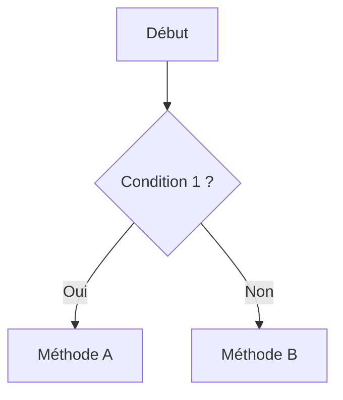

# FT-XXX — <% tp.file.title %>

> **Domaine** : #eurocodes / #assemblages / #pv
> **Norme(s)** : EN 1993-1-X §X.X.X
> **Statut** : 🟡 Brouillon | 🟢 Validé | 🔴 Obsolète

---

## 1. Contexte & Problématique

Décrire le problème technique rencontré en projet.

## 2. Règle Normative

### Formule principale
$$
F_{Rd} = \frac{f_y \cdot A}{\gamma_{M0}}
$$

### Clauses applicables
- EN 1993-1-X §X.X.X — Description
- AN française §X.X.X — Complément national

## 3. Application Pratique

### Conditions de validité
- [ ] Condition 1
- [ ] Condition 2

### Pièges courants
> [!WARNING]
> Décrire les erreurs fréquentes de dimensionnement

## 4. Arbre de Décision

## 5. Liens

- [[MOC_Eurocodes]] *(lien évident)*
- [[]] *(lien sagesse — principe universel relié)*

---

## Historique de validation

| Version | Date | Auditeur | Verdict |
|---|---|---|---|
| v0.1 | {{date}} | — | 🟡 Brouillon |

---

*Fiche produite par SIRIUS VAULT — [[🏠 Home|Retour accueil]]*
